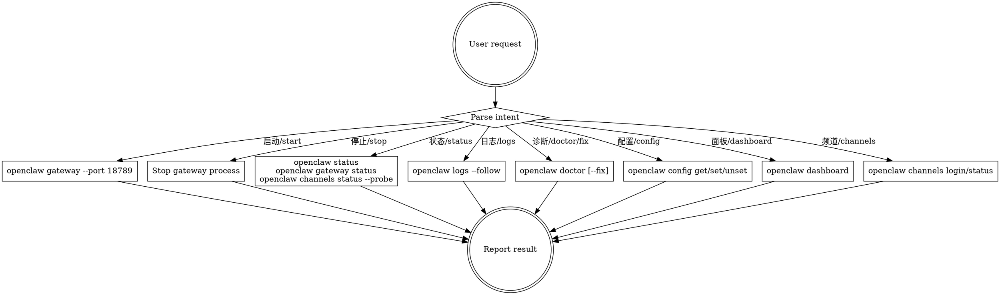

# OpenClaw Service Manager

Manage the local OpenClaw gateway — a self-hosted bridge connecting chat apps (WhatsApp, Telegram, Discord, iMessage) to AI coding agents.

## Quick Reference

| Action | Command |
|--------|---------|
| **Overall status** | `openclaw status` |
| **Gateway status** | `openclaw gateway status` |
| **Start gateway** | `openclaw gateway --port 18789` |
| **Start as daemon** | `openclaw onboard --install-daemon` |
| **Stop gateway** | Stop the running process or daemon |
| **Open dashboard** | `openclaw dashboard` |
| **Tail logs** | `openclaw logs --follow` |
| **Run diagnostics** | `openclaw doctor` |
| **Auto-fix issues** | `openclaw doctor --fix` |
| **Channel status** | `openclaw channels status --probe` |
| **Channel login** | `openclaw channels login` |
| **View config** | `openclaw config get <path>` |
| **Set config** | `openclaw config set <path> <value>` |
| **Remove config** | `openclaw config unset <path>` |
| **Interactive config** | `openclaw configure` |
| **Reinstall daemon** | `openclaw gateway install --force` |

## Workflow



## Intent Mapping

Parse the user's request (supports Chinese and English) and execute the matching command:

| Intent Keywords | Action |
|----------------|--------|
| `start`, `启动`, `开启`, `运行`, `run` | Start the gateway |
| `stop`, `停止`, `关闭`, `kill` | Stop the gateway |
| `restart`, `重启`, `重新启动` | Stop then start |
| `status`, `状态`, `check`, `检查` | Show full status overview |
| `logs`, `日志`, `log`, `查看日志` | Tail recent logs |
| `doctor`, `诊断`, `diagnose`, `fix`, `修复` | Run diagnostics |
| `config`, `配置`, `设置`, `settings` | View or edit configuration |
| `dashboard`, `面板`, `控制台`, `ui`, `web` | Open web control UI |
| `channels`, `频道`, `通道`, `渠道` | Manage channel connections |
| `info`, `信息`, `version`, `版本` | Show install info |

If no specific intent is detected, default to **status** — run all three status commands and present a summary.

## Action Details

### start
```bash
# Foreground (for testing/debugging)
openclaw gateway --port 18789

# As daemon (persistent)
openclaw onboard --install-daemon
```
After starting, verify with `openclaw gateway status`. Dashboard available at `http://127.0.0.1:18789/`.

### stop
Stop the running gateway process. If running as daemon, use system process management to stop it.

### restart
Execute stop followed by start. Verify with status check after restart.

### status
Run all three commands and present a unified summary:
```bash
openclaw status
openclaw gateway status
openclaw channels status --probe
```

### logs
```bash
openclaw logs --follow
```
Show the last ~50 lines. If user asks for specific log filtering, pipe through grep.

### doctor
```bash
# Diagnose only
openclaw doctor

# Diagnose and auto-fix
openclaw doctor --fix
```
Report findings clearly. If issues found, suggest `--fix` if not already used.

### config
```bash
# View all
openclaw config get

# View specific
openclaw config get agents.defaults.model.primary

# Set value
openclaw config set gateway.port 18789

# Remove
openclaw config unset <path>

# Interactive editor
openclaw configure
```
Config file: `~/.openclaw/openclaw.json` (JSON5 format, hot-reloads for most settings).

### dashboard
```bash
openclaw dashboard
```
Opens browser at `http://127.0.0.1:18789/`. Provides chat, configuration, sessions, and node monitoring.

### channels
```bash
# Login to channels
openclaw channels login

# Check channel connectivity
openclaw channels status --probe

# List pairings
openclaw pairing list --channel <channel>
```

### info
```bash
openclaw --version
openclaw config get gateway.port
echo "Config: ~/.openclaw/openclaw.json"
echo "Env: OPENCLAW_HOME, OPENCLAW_STATE_DIR, OPENCLAW_CONFIG_PATH"
```

## Environment Variables

| Variable | Purpose |
|----------|---------|
| `OPENCLAW_HOME` | Home directory for internal path resolution |
| `OPENCLAW_STATE_DIR` | Override state directory location |
| `OPENCLAW_CONFIG_PATH` | Override config file path |

## Troubleshooting

If status shows issues, follow this ladder:
1. `openclaw status` — overall health
2. `openclaw gateway status` — gateway specifically
3. `openclaw logs --follow` — recent errors
4. `openclaw doctor` — automated diagnostics
5. `openclaw doctor --fix` — attempt auto-repair
6. `openclaw gateway install --force` — reinstall daemon metadata

Common issues:
- **Port conflict (EADDRINUSE)**: Another process on port 18789. Change port or kill conflict.
- **Rate limiting (HTTP 429)**: Check model settings with `openclaw models status`.
- **No replies**: Check `openclaw pairing list --channel <channel>` and allowlist config.
- **Dashboard auth errors**: Rotate credentials, verify `gateway.mode="local"`.
